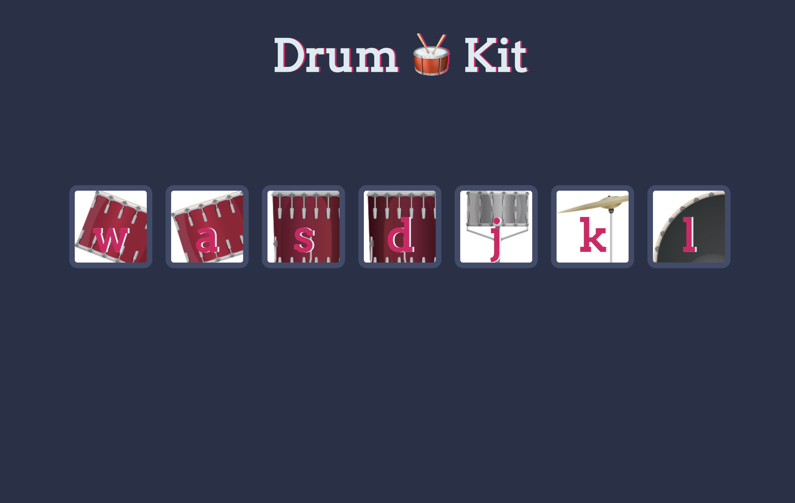

# Interactive Drum Kit App: <a href="https://66b095d6fe7aadb02b2187a5--glittering-raindrop-d6c08e.netlify.app/" target="_blank">Visit Here</a>

Unleash your inner rockstar with the Interactive Drum Kit App – the only place where you can bang out sick beats without disturbing the neighbors! Turn your keyboard into a full-blown drum set and channel your inner drummer, even if your rhythm is as offbeat as your uncle's dance moves. Warning: This app may cause spontaneous air guitar sessions and uncontrollable foot tapping!

## Tech used: 

## Optimizations

<li>Implement a debounce function for keypress events to prevent multiple triggers from rapid key presses.</li>
<li>Split JavaScript into smaller modules for better maintainability and potentially faster load times with tree shaking.</li>
<li>Allow users to record their drumming sessions and play them back to hear their creations.</li>
<li>Enable users to upload their own audio files to use as drum sounds, personalizing their drumming experience.</li>
<li>Implement a tutorial mode that guides new users through basic beats and rhythms, helping them learn how to use the app effectively and improve their drumming skills.</li>

## Lessons Learned:

<li>How to capture and handle various user events like clicks and key presses to trigger actions within the app.</li>
<li>How to debug JavaScript code using browser developer tools to troubleshoot and fix issues.</li>
<li>Understanding how to use the Audio API to play sound files and manage audio within a web application.</li>
<li>Managing asynchronous operations in JavaScript, such as loading audio files or handling user input without blocking the main thread.</li>